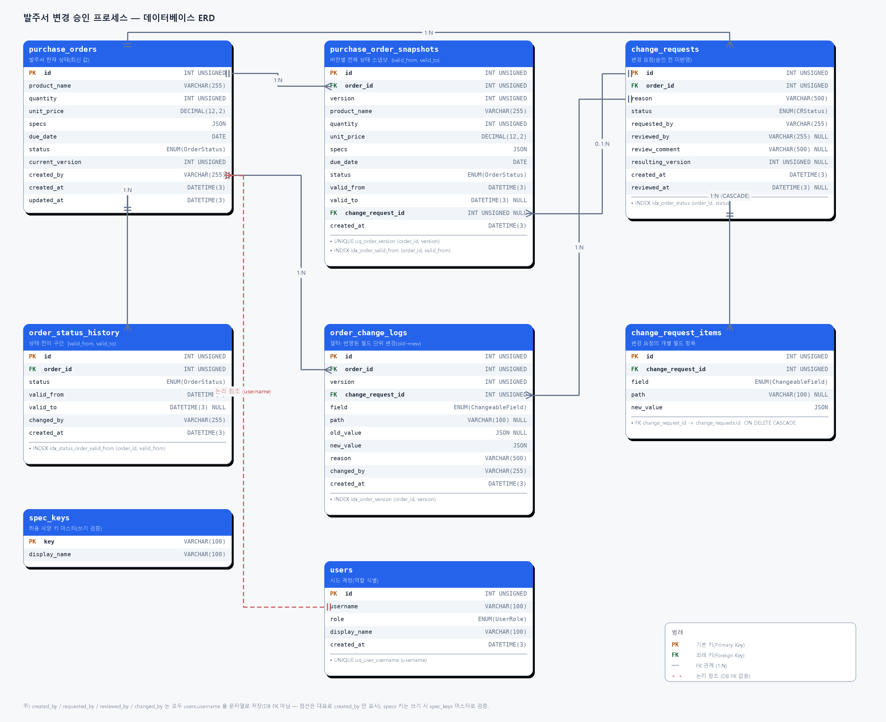

# 변경 이력 관리 설계 (DESIGN.md)

---

## 1. 선택한 방식

### 개요

발주서의 변경 이력을 **스냅샷(Snapshot) + 델타(Delta) 혼합** 전략으로 관리하고, 값 변경과 상태 전이를 분리해 기록한다. 

- **스냅샷** (`purchase_order_snapshots`): 발주서가 변경(승인)될 때마다 그 시점의 **전체 상태**를 버전 단위로 별도 테이블에 복제한다. 각 버전은 `[valid_from, valid_to)` 유효기간 구간을 가져, **버전 조회·시점 조회를 재구성 없이 단일 행 조회(O(1))** 로 처리한다.
- **델타** (`order_change_logs`): 같은 변경에서 **어떤 필드가 무엇→무엇으로** 바뀌었는지를 필드 단위로 저장한다. "누가/언제/무엇을/왜"의 감사 근거이자 버전 간 비교의 보조 기록이다.
- **상태 이력** (`order_status_history`): **상태 전이**(`DRAFT→PENDING→CONFIRMED→IN_PRODUCTION→COMPLETED`)는 값 변경이 아니므로 새 버전(스냅샷)을 만들지 않고, 이 테이블에 `[valid_from, valid_to)` 구간으로만 기록한다. 시점 조회의 `status` 는 스냅샷이 아니라 이 구간으로 보정한다.

저장 구조는 **정형 컬럼 + 가변 부분(`specs`)만 JSON** 으로 둔다(정형 컬럼은 검색·인덱싱·집계에 유리한 컬럼으로, 가변 사양은 JSON 으로 유연하게). 그리고 변경 승인 시 **발주서 본체 갱신 + 스냅샷 + 델타 저장을 하나의 트랜잭션**으로 묶고 **단일 `now`** 로 구간 경계를 맞춰, 부분 반영이나 구간 겹침/빈틈이 생기지 않게 한다.


### 데이터 구조

#### ERD (개요)

 

#### 테이블 스키마 

**`purchase_orders`** — 발주서의 *현재* 상태(읽기 편의용). 과거는 전적으로 스냅샷이 보유.

| 컬럼 | 타입 | 설명 |
|------|------|------|
| `id` | int unsigned PK | |
| `product_name` | varchar(255) | 상품명 |
| `quantity` | int unsigned | 수량(>0) |
| `unit_price` | decimal(12,2) | 단가(>=0). `decimalTransformer` 로 number 매핑 |
| `specs` | json | 사양 `{ color, size, ... }`. 키는 `spec_keys` 마스터로 제한 |
| `due_date` | date | 납기일(`YYYY-MM-DD`) |
| `status` | enum(OrderStatus) | 현재 상태(기본 `DRAFT`) |
| `current_version` | int unsigned | 현재 스냅샷 버전(생성 시 1, 승인마다 +1) |
| `created_by` | varchar(255) | 주문자 식별자(username) |
| `created_at` | datetime(3) | 생성 시각 |
| `updated_at` | datetime(3) | 갱신 시각(`ON UPDATE CURRENT_TIMESTAMP(3)`) |

**`purchase_order_snapshots`** — 버전별 전체 상태(스냅샷). 버전/시점 조회의 단일 진실 소스.

| 컬럼 | 타입 | 설명 |
|------|------|------|
| `id` | int unsigned PK | |
| `order_id` | int unsigned FK | |
| `version` | int unsigned | 1..N |
| `product_name` / `quantity` / `unit_price` / `specs` / `due_date` / `status` | (본체와 동일) | **당시 값** 복제 |
| `valid_from` | datetime(3) | 이 버전이 적용된 시각 |
| `valid_to` | datetime(3) NULL | 다음 버전 시작 시각(최신 버전=NULL) |
| `change_request_id` | int unsigned NULL | 이 버전을 만든 변경요청(버전1=생성이므로 NULL) |
| `created_at` | datetime(3) | 행 생성 시각 |

- 제약: `UNIQUE uq_order_version(order_id, version)`, `INDEX idx_order_valid_from(order_id, valid_from)`.
- `datetime(3)`(밀리초)로 같은 초 내 변경도 구분 → 시점 조회 경계 정확성.

**`order_change_logs`** — 승인되어 반영된 필드 단위 델타.

| 컬럼 | 타입 | 설명 |
|------|------|------|
| `id` | int unsigned PK | |
| `order_id` | int unsigned | 발주서 |
| `version` | int unsigned | 이 변경으로 만들어진 버전 |
| `change_request_id` | int unsigned | 이 델타를 만든 변경요청 |
| `field` | enum(ChangeableField) | productName/quantity/unitPrice/specs/dueDate |
| `path` | varchar(100) NULL | specs 하위 키만 바뀐 경우 그 키(아니면 NULL) |
| `old_value` | json NULL | 변경 전 값(신규 사양 키면 NULL) |
| `new_value` | json | 변경 후 값 |
| `reason` | varchar(500) | 변경 사유(역정규화 보관) |
| `changed_by` | varchar(255) | 승인자(username) |
| `created_at` | datetime(3) | 행 생성 시각 |

- 제약: `INDEX idx_log_order_version(order_id, version)`.

**`change_requests`** — 변경 요청(주문자가 제출한 변경 의도). 승인 전에는 발주서에 반영되지 않는다.

| 컬럼 | 타입 | 설명 |
|------|------|------|
| `id` | int unsigned PK | |
| `order_id` | int unsigned | 대상 발주서 |
| `reason` | varchar(500) | 변경 사유 |
| `status` | enum(ChangeRequestStatus) | PENDING/APPROVED/REJECTED(기본 PENDING) |
| `requested_by` | varchar(255) | 요청자(username) |
| `reviewed_by` | varchar(255) NULL | 검토자(승인/반려 전 NULL) |
| `review_comment` | varchar(500) NULL | 검토 의견(승인/반려 시 기록) |
| `resulting_version` | int unsigned NULL | 승인 시 생성된 버전(반려/대기=NULL) |
| `created_at` | datetime(3) | 요청 시각 |
| `reviewed_at` | datetime(3) NULL | 검토 시각 |

- 제약: `INDEX idx_order_status(order_id, status)` — "동일 발주서 PENDING 존재" 검사용.

**`change_request_items`** — 변경 요청의 개별 필드 변경 항목(`change_requests` 1:N).

| 컬럼 | 타입 | 설명 |
|------|------|------|
| `id` | int unsigned PK | |
| `change_request_id` | int unsigned | 소속 변경요청(`ON DELETE CASCADE`) |
| `field` | enum(ChangeableField) | 변경 대상 필드 |
| `path` | varchar(100) NULL | specs 하위 키만 변경 시 그 키(아니면 NULL) |
| `new_value` | json | 변경 후 값(타입 보존을 위해 JSON) |

- 요청 시점엔 `old_value` 를 저장하지 않는다 — 승인 시점의 현재값이 진실이므로 델타에서 확정한다.

**`order_status_history`** — 상태 전이 구간.

| 컬럼 | 타입 | 설명 |
|------|------|------|
| `id` | int unsigned PK | |
| `order_id` | int unsigned | 발주서 |
| `status` | enum(OrderStatus) | 이 구간의 상태 |
| `valid_from` | datetime(3) | 상태 진입 시각 |
| `valid_to` | datetime(3) NULL | 다음 상태 진입 시각(현재=NULL) |
| `changed_by` | varchar(255) | 전이 수행자(username) |
| `created_at` | datetime(3) | 행 생성 시각 |

- 제약: `INDEX idx_status_order_valid_from(order_id, valid_from)`.

**`users`** — 시드 계정. 클라이언트는 `username`(`X-User-Id`)만 보내고, 역할은 이 테이블에서 결정된다(역할 위조 방지).

| 컬럼 | 타입 | 설명 |
|------|------|------|
| `id` | int unsigned PK | |
| `username` | varchar(100) | 로그인 식별자(`X-User-Id`) |
| `role` | enum(UserRole) | BUYER/SOURCING/MANUFACTURER |
| `display_name` | varchar(100) | 표시명 |
| `created_at` | datetime(3) | 행 생성 시각 |

- 제약: `UNIQUE uq_user_username(username)`.
- 비밀번호 컬럼 없음(신원 검증 미수행 — 과제 목적은 역할 식별). 근거: `docs/AUTH_PLAN.md §0`.

**`spec_keys`** — 허용 사양(specs) 키 마스터. 발주서 생성 시 specs 키는 이 테이블에 정의된 키만 허용한다(쓰기 검증).

| 컬럼 | 타입 | 설명 |
|------|------|------|
| `key` | varchar(100) PK | 사양 키 이름(예: color, size, material) |
| `display_name` | varchar(100) | 표시명(프론트 라벨). 검증에는 미사용 |

- 부팅 시 시드(`color`, `size`, `material`)를 멱등 생성. 마스터에 없는 키로 생성 시 `422`.
- 과거 자유 입력 데이터/이력 조회는 이 제약과 무관하게 동작(읽기는 관대, 쓰기만 엄격).
- PROD-NOTE: 운영자 무중단 키 관리(활성 여부·카테고리)는 과제 범위 제외.

#### Enum

```ts
enum OrderStatus { DRAFT, PENDING, CONFIRMED, IN_PRODUCTION, COMPLETED } // 문자열 값 동일
enum ChangeRequestStatus { PENDING, APPROVED, REJECTED }
enum ChangeableField { PRODUCT_NAME='productName', QUANTITY='quantity',
                       UNIT_PRICE='unitPrice', SPECS='specs', DUE_DATE='dueDate' }
enum UserRole { BUYER, SOURCING, MANUFACTURER }
```
- `ChangeableField` 의 값은 `PurchaseOrder`/스냅샷의 프로퍼티명과 1:1로 맞춰, 적용·비교 시 키로 직접 사용한다.
- `OrderStatus`는 순서 비교("CONFIRMED 이상")가 필요하므로 순위 맵(`ORDER_STATUS_RANK`)을, 허용 전이는 `ORDER_STATUS_TRANSITIONS` 로 둔다.

#### Entity 구조

TypeORM 엔티티는 도메인별로 위치한다. 본체·스냅샷·델타·상태이력을 분리해, 본체는 가볍게 유지하고 이력은 독립적으로 누적된다.

| Entity | 테이블 | 위치 | 관계 |
|--------|--------|------|------|
| `PurchaseOrder` | `purchase_orders` | `orders/entities` | 본체(현재 상태). 스냅샷/델타/상태이력은 `order_id` 로 약결합(명시적 FK 미선언) |
| `PurchaseOrderSnapshot` | `purchase_order_snapshots` | `history/entities` | 버전별 전체 상태. `order_id`+`version` 유일 |
| `OrderChangeLog` | `order_change_logs` | `history/entities` | 필드 단위 델타. `order_id`+`version` 으로 버전에 묶임 |
| `OrderStatusHistory` | `order_status_history` | `history/entities` | 상태 구간 `[valid_from, valid_to)` |
| `ChangeRequest` | `change_requests` | `change-requests/entities` | `@OneToMany` → `ChangeRequestItem`(cascade) |
| `ChangeRequestItem` | `change_request_items` | `change-requests/entities` | `@ManyToOne` → `ChangeRequest`(`ON DELETE CASCADE`) |
| `User` | `users` | `auth/entities` | 독립(주체·역할 식별) |
| `SpecKey` | `spec_keys` | `orders/entities` | 독립(허용 키 마스터) |

관계 설계 메모:
- **명시적 FK 관계(`@ManyToOne`/`@JoinColumn`)는 `ChangeRequest ↔ ChangeRequestItem` 한 쌍에만** 둔다. 항목은 요청과 강하게 묶이고 요청 삭제 시 함께 지워져야 하므로(cascade) 객체 그래프로 다룬다.
- **스냅샷·델타·상태이력은 발주서와 `order_id` 스칼라 컬럼으로만 연결**한다(TypeORM 관계 미선언). 이력은 append-only 로 독립 누적되고, 본체 로딩 시 무거운 이력을 끌고 오지 않게 하기 위함이다(조회는 각 서비스에서 명시적 쿼리로).
- `change_request_id` 는 스냅샷/델타에서 "이 버전을 만든 변경요청"을 가리키는 추적용 스칼라 컬럼이다(관계 미선언, 버전1=NULL).

### 동작 방식

#### 변경 승인 시 어떻게 저장되는가? — 단일 트랜잭션

소싱팀이 변경요청을 승인하면, 아래가 **하나의 트랜잭션**(`DataSource.transaction`)으로 처리된다. 트랜잭션 진입 직후 `now` 를 한 번 읽어 모든 시각 컬럼에 같은 값을 쓴다.

1. 변경요청 로드 + **PENDING 검증**(아니면 `409`).
2. 발주서 로드(없으면 `404`). **완료(COMPLETED) 발주서면 `409`**.
3. 요청 항목별로 **현재 값(old)** 을 읽고, 실제로 값이 바뀐 항목만 발주서 필드에 적용하며 델타 후보를 만든다(동일 값 항목은 건너뜀).
4. **델타가 0건이면** 빈 버전을 만들지 않고 `422`로 거부(스냅샷·버전 증가 이전에 던져 전체 롤백).
5. `newVersion = current_version + 1`.
6. **직전 최신 스냅샷의 `valid_to = now`로 닫음**(`valid_to IS NULL` 행 갱신).
7. 발주서 본체 업데이트(새 값, `current_version = newVersion`).
8. **새 스냅샷 저장**(`version = newVersion`, `valid_from = now`, `valid_to = NULL`, `change_request_id`).
9. **델타(`order_change_logs`) 저장** — 바뀐 필드만(`field`/`path`/`old→new`/`reason`/`changed_by`/`version`).
10. 변경요청 업데이트(`APPROVED`, `reviewed_by`, `review_comment`, `reviewed_at`, `resulting_version`).

> 검증 순서가 핵심: **"실질 변경 없음(422)" 판정을 스냅샷 생성·버전 증가보다 먼저** 한다. 그래야 빈 버전 행이 생기지 않는다.
> **반려 시**: 변경요청만 `REJECTED`로 갱신, 발주서·스냅샷·델타는 불변. 반려는 다중 쓰기가 아니므로 트랜잭션으로 감싸지 않는다.

여러 필드를 한 변경요청에서 동시에 바꿔도 **스냅샷 1행 + 델타 N행(같은 `version`)** 으로 묶여 하나의 버전이 된다.

#### 특정 시점 조회 시 어떻게 데이터를 가져오는가?

`[valid_from, valid_to)` 반열림 유효기간 구간을 단일 인덱스 범위 검색으로 찾는다.

```sql
SELECT * FROM purchase_order_snapshots
WHERE order_id = :id
  AND valid_from <= :t
  AND (valid_to IS NULL OR valid_to > :t)
ORDER BY version DESC LIMIT 1;
```

- 경계 규칙: `valid_from` 시각 **자체는 그 버전에 포함**, `valid_to` 시각은 다음 버전(반열림).
- `ORDER BY version DESC LIMIT 1`: 같은 발주서의 스냅샷 구간은 서로 겹치지 않으므로 조건을 만족하는 행은 사실상 하나다. 정렬은 경계가 맞닿는 순간(앞 구간의 `valid_to` == 뒤 구간의 `valid_from`)에 **최신 버전을 택하기 위한 안전장치**다.
- 값(수량/납기/사양)은 스냅샷에서 가져오되, **status 는 `order_status_history`의 그 시점 유효 상태로 보정**한다. 상태 전이는 새 스냅샷을 만들지 않으므로 스냅샷의 `status` 는 그 버전 생성 당시 값으로 고정되어 실제와 어긋날 수 있다 — 그래서 `getStatusAt(orderId, t)` 로 그 시점 상태를 따로 조회해 덮어쓴다.
- `time < 최초 valid_from`이면 결과 없음 → `404`.

#### 변경 비교는 어떻게 수행하는가?

두 버전의 스냅샷을 읽어 **필드별로 직접 비교**(스냅샷 diff), 달라진 항목만 반환한다.

- 비교 대상: `productName`, `quantity`, `unitPrice`, `dueDate`, `specs`(= `ChangeableField` 전체).
- 스칼라 필드는 `valuesEqual` 로, `specs` 는 **키 단위로 펼쳐 비교**한다(어떤 사양 키가 바뀌었는지 감사). 한쪽에만 있는 키는 없는 쪽을 `null` 로 표기.
- 어떤 두 버전이든 행 조회 2번 + 단순 비교로 끝난다.

---

## 2. 의사결정 과정


### 2.1 무엇을 저장할 것인가?

과거 상태를 **전체 스냅샷으로 복제할지, 바뀐 부분(델타)만 남길지** 두 축을 어떻게 조합하느냐로 고민 했다다.

| 후보 | 설명 | 장점 | 단점 |
|------|------|------|------|
| **A. 스냅샷 중심 + 델타**  | 버전마다 전체 스냅샷 + 바뀐 필드 델타를 함께 | 조회는 스냅샷으로 단순·정확(재구성 불필요), 감사·비교는 델타로 풍부, 둘이 교차 검증 | 같은 사실을 두 곳에 저장 → 쓰기 정합성 책임(트랜잭션 필요), 스냅샷 공간 중복 |
| B. 델타 중심 + 주기적 스냅샷 | 델타를 1차 저장소로, 일정 주기마다만 스냅샷 | 공간 효율적(이벤트 소싱에 가까움) | 조회 시 "최근 스냅샷 + 이후 델타 재생"이 필요 → 조회 복잡·재생 로직 버그 위험 |

**선택**: B는 공간이 효율적이지만, 조회마다 델타를 재생해야 해서 "그 시점 발주서가 어땠나"를 보여주는 데 로직과 비용이 더 든다. A는 공간을 더 쓰지만 조회가 단일 행으로 끝난다. 발주서 변경 승인 프로세서 상 **조회 정확성·단순성이 1순위**이고 동시성/대용량은 평가 범위 밖이라, 공간 중복을 감수하더라도 조회가 단순한 **A — 스냅샷 중심 + 델타 혼합(= 본문의 C 혼합)** 을 택했다. 공간이 평가 대상이었다면 B(델타 중심 + 주기 스냅샷)을 선택했을 것이다. 


### 2.2 어떻게 저장할 것인가? (저장 구조)

스냅샷을 **정형 컬럼으로 펼칠지, 상태 전체를 JSON 한 덩어리로 둘지** 고민 했다.

| 후보 | 설명 | 장점 | 단점 |
|------|------|------|------|
| **A. 정형 컬럼 + 가변 부분만 JSON**  | 별도 스냅샷/델타 테이블에 필드를 컬럼으로 두되, 사양(`specs`)만 JSON | 필드 단위 검색·인덱싱·집계 자연스러움, 타입·제약 강제 | 사양 키 추가 시 유연성은 JSON 부분에 한정 |
| B. 상태 전체를 JSON 통째 저장 | 발주서 한 상태를 JSON 한 컬럼으로 | 스키마 변경에 매우 유연 | MySQL 에서 내부 필드 검색·인덱싱·집계가 불리, 타입 검증 약함 |

**선택**: 사양처럼 키가 가변인 부분은 JSON 이 편하지만, 발주서 본질 필드(수량·단가·납기·상태)는 검색·비교·집계 대상이라 JSON 으로는 불리하다고 판단했다. 따라서 발주서 특성상 정형 필드는 컬럼으로 검색·인덱싱·집계를 챙기고, **가변 속성인 `specs` 만 JSON** 으로 유연성을 확보하는 **A(정형 컬럼 + 가변 부분만 JSON)** 를 택했다. 


### 2.3 조회는 어떻게 할 것인가? (시점 재구성 전략)

"특정 시점에 발주서가 어땠는가"를 어떻게 돌려줄지 재구성 없이 한 행으로 끝낼지, 델타를 재생해 복원할지 고민 했다.

| 후보 | 설명 | 장점 | 단점 |
|------|------|------|------|
| **A. 재구성 없이 — 유효기간 구간 단일 행 조회** | 스냅샷에 `[valid_from, valid_to)` 를 두고 그 시점을 포함하는 한 행을 범위 검색 | 조회가 인덱스 한 번 + 단일 행, 경계가 행에 명시됨 | 버전마다 전체 스냅샷 저장(공간 비용) |
| B. 재구성하되 쿼리로 속도 보전 — 델타 재생 | 초기값 + 그 시점까지 델타를 재생해 복원 | 스냅샷 불필요(공간 절약) | 조회마다 재생 → 쿼리·로직 복잡, 인덱스 튜닝으로도 단일 행 조회를 못 이김 |

**선택**: B는 델타 중심와 짝을 이루는 조회 전략으로 공간엔 유리하나, 시점 조회가 잦은 프로젝트에서는는 매 조회 재생은 비용·복잡도가 크다. 인덱스를 잘 잡아도 한 행 읽기의 단순함을 넘기 어렵다고 판단 했다. 또한 스냅샷을 1차 저장소로 정했으므로, 조회도 **A — 재구성 없이 유효기간 구간으로 단일 행 조회**가 자연스러워. `[valid_from, valid_to)` 반열림으로 경계를 행에 명시해 시점 조회를 범위 검색 한 번으로 끝내는게 좋다고 판단 했다다.

- 필요한 인덱스: 버전 조회 `UNIQUE(order_id, version)`, 시점 조회 `INDEX(order_id, valid_from)`, 델타 `INDEX(order_id, version)`.


### 최종 선택 이유

 모두 **"조회 정확성·단순성 우선"** 이라는 같은 기준에서 나왔고, 그에 맞춰 선택 했다.

의류 발주서는 그 시점에 발주서가 어땠는지를 빠르고 정확히 보여주는 게 핵심이므로 조회 정확성·단순성을 1순위에 뒀고, 그래서 **스냅샷**을 1차 저장소로 두어 `[valid_from, valid_to)` 구간으로 시점 조회를 단일 행으로 끝냈다다. 동시에 "누가/언제/무엇을/왜 변경했는가"와 "변경 사유·검토 의견 기록"이 요구사항에 명시돼 있어 델타가 필드 단위 변경 의도·사유를 직접 남기며, 스냅샷과 델타는 한 트랜잭션에서 함께 써 서로 교차 검증하도록 했다. 저장 구조는 검색·인덱싱·집계가 필요한 본질 필드(수량·단가·납기·상태)를 정형 컬럼으로 두고 가변 속성인 `specs` 만 JSON 으로 확장 여지를 남겼다. 이 모든 선택은 대용량/성능/동시성이 평가 범위 밖이라는 전제 위에서 스냅샷 중복 저장의 공간 비용을 감수한 결과로 조회 정확성·단순성 우선시 했을 경우 옳다고 생각했다. 대용량 데이터 처리가 평가 대상이었다면 무거워지는 쪽은 매 버전 전체를 복제하는 스냅샷이지 델타가 아니므로 "델타 중심 + 주기적 스냅샷"을 택했을 것이다


---

## 3. 구현 상세

### 3.1 핵심 로직 — 승인 트랜잭션

승인 시 본체+스냅샷+델타를 단일 트랜잭션으로 묶고, **단일 `now`** 로 직전 버전을 닫고 새 버전을 연다(`valid_to == 다음 valid_from` 경계 일치).


```ts
// 트랜잭션 manager 안에서 실행
async createSnapshot(manager, order, version, validFrom, changeRequestId) {
  const repo = manager.getRepository(PurchaseOrderSnapshot);
  return repo.save(repo.create({
    orderId: order.id, version,
    productName: order.productName, quantity: order.quantity,
    unitPrice: order.unitPrice, specs: order.specs,
    dueDate: order.dueDate, status: order.status,
    validFrom, validTo: null, changeRequestId,
  }));
}

// 직전 최신 스냅샷(valid_to IS NULL)을 closeAt 으로 닫아 [from, to) 를 빈틈없이 잇는다
async closeCurrentSnapshot(manager, orderId, closeAt) {
  await manager.getRepository(PurchaseOrderSnapshot)
    .createQueryBuilder().update(PurchaseOrderSnapshot)
    .set({ validTo: closeAt })
    .where('order_id = :orderId AND valid_to IS NULL', { orderId })
    .execute();
}
```


위 두 메서드는 `SnapshotService` 에 있고 승인 트랜잭션의 `manager` 를 받아 같은 트랜잭션에서 실행된다. 흐름은 **닫기(`closeCurrentSnapshot`) → 본체 갱신 → 열기(`createSnapshot`)** 순서이며, 셋 다 동일한 `now`(닫기의 `closeAt` = 새 스냅샷의 `validFrom`)를 써서 구간이 빈틈·겹침 없이 맞닿는다. 닫기는 `valid_to IS NULL` 인 직전 최신 행 하나만 갱신하므로 대상이 명확헤진다.

### 3.2 핵심 로직 — 시점 조회

`[valid_from, valid_to)` 반열림 구간을 만족하는 스냅샷 한 행을 범위 검색으로 찾는다. 값은 그 스냅샷에서 그대로 쓰되, `status` 는 스냅샷 고정값을 믿지 않고 `getStatusAt` 으로 그 시점의 실제 상태를 따로 조회해 덮어쓴다 — 상태 전이는 새 스냅샷을 만들지 않아 스냅샷의 `status` 가 그 버전 생성 당시 값에 묶여 있기 때문이다. 조건을 만족하는 행이 없으면 - `404`.

```ts
async getAt(orderId, timestamp) {
  const snapshot = await this.snapshotRepo.createQueryBuilder('s')
    .where('s.order_id = :orderId', { orderId })
    .andWhere('s.valid_from <= :t', { t: timestamp })
    .andWhere('(s.valid_to IS NULL OR s.valid_to > :t)', { t: timestamp })
    .orderBy('s.version', 'DESC')
    .getOne();
  if (!snapshot) throw new NotFoundException(/* 해당 시점에 발주서 없음 */);

  const dto = SnapshotStateDto.fromEntity(snapshot);
  // 상태는 스냅샷 고정값이 아니라 그 시점 유효 상태로 보정
  const statusAt = await this.snapshotService.getStatusAt(
    this.dataSource.manager, orderId, timestamp);
  if (statusAt !== null) dto.status = statusAt;
  return dto;
}
```

### 3.3 핵심 로직 — 버전 비교(diff)

두 버전의 스냅샷을 각각 한 행씩 읽어(둘 중 하나라도 없으면 `404`) `ChangeableField` 전체를 순회하며 비교한다. 스칼라 필드는 `valuesEqual` 로 같지 않을 때만 차이로 담고, `specs` 는 `diffSpecs` 가 양쪽 키의 합집합을 돌며 키 단위로 비교한다(한쪽에만 있는 키는 없는 쪽을 `null` 로 → 키 추가/삭제도 차이로 노출). 행 2개의 직접 비교라 어떤 두 버전이든 비용이 일정하다.

```ts
async diff(orderId, fromVersion, toVersion) {
  const [from, to] = await Promise.all([
    this.snapshotRepo.findOne({ where: { orderId, version: fromVersion } }),
    this.snapshotRepo.findOne({ where: { orderId, version: toVersion } }),
  ]);
  if (!from || !to) throw new NotFoundException(/* 버전 없음 */);

  const differences = [];
  for (const field of DIFF_FIELDS) {
    if (field === ChangeableField.SPECS) {
      differences.push(...this.diffSpecs(from.specs, to.specs));
      continue;
    }
    const a = this.readSnapshotField(from, field);
    const b = this.readSnapshotField(to, field);
    if (!valuesEqual(a, b)) differences.push({ field, path: null, from: a, to: b });
  }
  return { fromVersion, toVersion, differences };
}
```
### 3.4 핵심 로직 — 변경 추적 ("누가, 언제, 무엇을, 왜 변경했는가?")

"누가·언제·무엇을·왜"는 델타(`order_change_logs`) 한 행에 모두 담긴다 — `changed_by`(누가, 승인 주체), `valid_from`(언제, 단일 `now`), `field`+`path`+`old_value→new_value`(무엇을), `reason`(왜, 요청 사유 복사). 핵심은 **`old_value` 를 요청 시점이 아니라 승인 시점의 현재값으로 확정**하는 것으로, 요청~승인 사이에 다른 변경이 끼어도 실제 변화가 정확하다. 반려/대기 요청은 델타가 없어, 이력 조회 시 그 시점 스냅샷으로 `old_value`/`state` 를 합성해 보여준다.

```ts
// 실제로 값이 바뀐 필드만 델타로 기록(요청했으나 동일 값이면 제외).
const logs: OrderChangeLog[] = [];
const logRepo = manager.getRepository(OrderChangeLog);
for (const item of cr.items) {
  const oldValue = readField(order, item.field, item.path); // 승인 시점 현재값
  if (valuesEqual(oldValue, item.newValue)) continue;        // 동일 값이면 델타 없음
  applyField(order, item.field, item.newValue, item.path);   // 발주서에 새 값 적용
  logs.push(logRepo.create({
    orderId: order.id, version: newVersion, changeRequestId: cr.id,
    field: item.field, path: item.path,                      // 무엇을(필드/specs 키)
    oldValue: oldValue ?? null, newValue: item.newValue,     // old → new
    reason: cr.reason,                                       // 왜(요청 사유 복사)
    changedBy: reviewer.userId,                              // 누가(승인 주체)
  }));
}

// 실질 변경이 없으면(델타 0건) 빈 버전을 만들지 않고 거부 → 트랜잭션 롤백.
if (logs.length === 0) {
  throw new UnprocessableEntityException(ERROR_MESSAGES.NO_EFFECTIVE_CHANGE);
}
```

`field`(+`path`)·`old→new`·`reason`·`changed_by` 가 한 행에 모이고, **언제**는 같은 트랜잭션의 단일 `now`(스냅샷 `valid_from`)로 결정된다. specs 의 특정 키만 바뀐 경우 `path` 에 그 키가 들어가 키 단위로 추적된다.

### 3.5 비즈니스 규칙 (서비스 레이어에서 강제)

상태 전이·권한은 컨트롤러/가드/DTO에서 1차 차단하고 서비스에서 최종 강제한다.

#### (1) 상태 라이프사이클 전이

`ORDER_STATUS_TRANSITIONS` 맵에 정의된 전이만 허용하고, 정의되지 않은 전이(건너뛰기·역행·동일 상태)는 `409`.

| from | 허용 to | 수행 역할 |
|------|---------|-----------|
| `DRAFT` | `PENDING` | **BUYER**(제출 — 자기 작성본을 검토 요청) |
| `PENDING` | `CONFIRMED` | **SOURCING** |
| `CONFIRMED` | `IN_PRODUCTION` | **SOURCING** |
| `IN_PRODUCTION` | `COMPLETED` | **SOURCING** |
| `COMPLETED` | (없음) | — |

- 전이 역할: **`DRAFT→PENDING` 만 BUYER, 그 외 모든 전이는 SOURCING**(위반 → `403`). 단순화 위해 `PATCH /orders/:id/status` 는 두 역할을 모두 허용하고, 서비스에서 현재 상태에 따라 실제 권한을 가린다.
- 상태 전이는 **새 스냅샷을 만들지 않고** `order_status_history` 에 `[valid_from, valid_to)` 구간으로만 기록한다

#### (2) 변경요청 생성 (BUYER)

- 발주서가 **`CONFIRMED` 이상**일 때만 가능(`DRAFT`/`PENDING` → `409`). 단 **`COMPLETED` 는 제외**(완료 발주서는 변경 대상 아님 → `409`).
- 같은 발주서에 **`PENDING` 변경요청이 존재하면 신규 생성 불가**(`409`).
- 변경 항목은 **1개 이상**(0개 → `400`, DTO `@ArrayMinSize(1)`).
- `field=specs` 의 키 규칙:
  - `path` 는 **`specs` 필드에서만** 허용(다른 필드에 지정 → `400`).
  - 변경 대상 specs 키는 **발주서에 이미 존재하는 키**여야 함(신규 키 추가 불가 → `422`). 발주서 생성 시 키가 `spec_keys` 마스터로 제한되므로, 변경요청은 그 기존 키 안에서만 동작한다.
- 역할 위반(BUYER 아님) → `403`.

#### (3) 승인 / 반려 (SOURCING)

- **`PENDING` 변경요청만** 승인/반려 가능(이미 처리된 건 → `409`).
- 승인/반려 모두 **검토 의견(`reviewComment`) 필수**(빈 값 → `400`).
- **승인**: 발주서 반영 + 스냅샷 + 델타를 단일 트랜잭션으로. 단,
  - 모든 항목이 기존값과 동일하면(**델타 0건**) 빈 버전을 만들지 않고 `422`.
  - 대상 발주서가 이미 **`COMPLETED`** 면 `409`(완료 후 반영 방지).
- **반려**: 변경요청만 `REJECTED` 로 갱신, 발주서·버전은 불변.
- 역할 위반(SOURCING 아님) → `403`.

#### (4) 완료(COMPLETED) 시 미결 정리
- `IN_PRODUCTION→COMPLETED` 전이 시, 남은 **`PENDING` 변경요청을 자동 반려**한다(검토 의견·시각 기록). 완료된 발주서에 미결 요청이 남아 모순되는 상태를 차단한다.
- 자동 반려와 짝을 이뤄, `COMPLETED` 발주서의 변경요청 승인 시도는 `409` 로 막는다.

#### (5) 발주서 생성
- **BUYER만** 생성 가능(`403`). 생성 시 `DRAFT` + 버전1 스냅샷 + DRAFT 상태 구간을 단일 트랜잭션으로.
- `specs` 키는 `spec_keys` 마스터에 정의된 키만(미정의 → `422`).


### 3.6 예외 상황 처리

| 상황 | 처리 |
|------|------|
| 존재하지 않는 버전 조회 (예: version=99) | `404 NotFoundException` ("해당 버전이 존재하지 않습니다") |
| 최초 `valid_from` 이전 시점 조회 | `404` ("해당 시점에 발주서가 존재하지 않습니다") |
| diff 시 두 버전 중 하나라도 없음 | `404` (한쪽만 없어도 비교 불가) |
| 존재하지 않는 발주서 | `404` |
| 권한 위반 (역할 불일치) | `403 ForbiddenException` |
| 상태/규칙 위반 (중복 PENDING, 잘못된 전이 등) | `409 ConflictException` |
| 실질 변경 없는 승인(델타 0건) | `422 UnprocessableEntityException` |
| 입력 검증 실패 (items 0개 등) | `400` (ValidationPipe 자동) |
| 트랜잭션 중 일부 실패 | 전체 롤백(부분 반영 방지) |

> **데이터 불일치 방지**: 본체+스냅샷+델타를 단일 트랜잭션으로 묶고 단일 `now`로 구간 경계를 일치시켜, 스냅샷 구간이 겹치거나 비는 일을 원천 차단한다.

---
